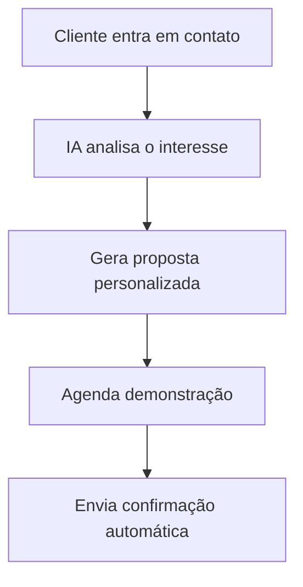
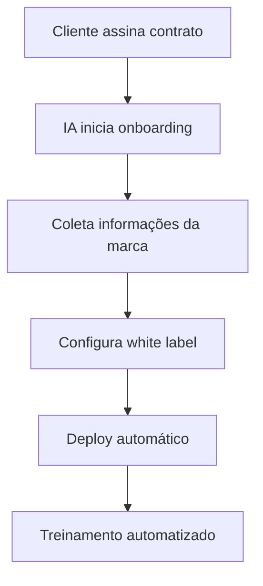
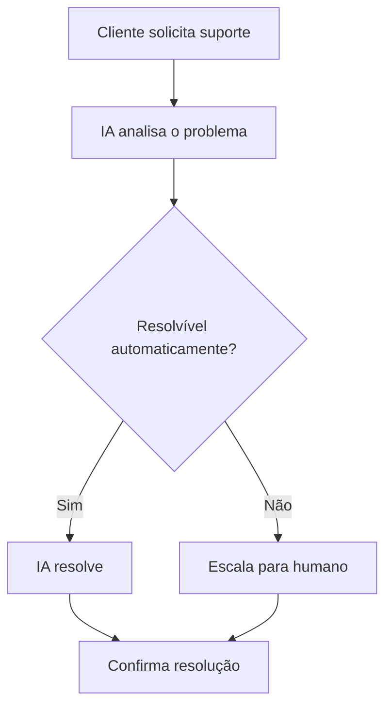

# 🤖 Automação Completa do Master Dashboard

## 📋 Visão Geral

Este documento descreve a implementação de uma automação completa no Master Dashboard da FlowTrip, onde a IA assume o controle total das operações de atendimento ao cliente, incluindo email, chat, WhatsApp e personalização white label.

## 🎯 Objetivos da Automação

### **1. Atendimento Automatizado**
- **Email**: Resposta automática e personalizada
- **Chat**: Conversas em tempo real com IA
- **WhatsApp**: Integração com API do WhatsApp Business
- **Telefone**: Sistema de agendamento inteligente

### **2. Personalização White Label**
- **Configuração Automática**: IA configura plataformas personalizadas
- **Branding**: Aplicação automática de cores, logos e identidade
- **Funcionalidades**: Seleção inteligente de recursos
- **Deploy**: Implementação automática

### **3. Gestão de Clientes**
- **Onboarding**: Processo automatizado de integração
- **Suporte**: Resolução de problemas com IA
- **Analytics**: Relatórios automáticos de performance
- **Retenção**: Estratégias automáticas de fidelização

## 🏗️ Arquitetura da Automação

### **Componentes Principais**

```typescript
// Estrutura da automação
interface AutomationSystem {
  // Atendimento
  customerService: {
    email: EmailAutomation;
    chat: ChatAutomation;
    whatsapp: WhatsAppAutomation;
    phone: PhoneAutomation;
  };
  
  // White Label
  whiteLabel: {
    configuration: WhiteLabelConfig;
    deployment: AutoDeployment;
    customization: BrandCustomization;
  };
  
  // Gestão
  management: {
    onboarding: ClientOnboarding;
    support: AutomatedSupport;
    analytics: PerformanceAnalytics;
    retention: ClientRetention;
  };
}
```

## 📧 Sistema de Email Automatizado

### **Funcionalidades**
- **Resposta Automática**: IA responde emails em tempo real
- **Personalização**: Adapta tom e conteúdo ao cliente
- **Follow-up**: Acompanhamento automático
- **Integração**: Conecta com CRM e analytics

### **Implementação**
```typescript
class EmailAutomation {
  async processEmail(email: Email): Promise<EmailResponse> {
    // 1. Análise do conteúdo
    const analysis = await this.analyzeEmail(email);
    
    // 2. Geração de resposta
    const response = await this.generateResponse(analysis);
    
    // 3. Personalização
    const personalized = await this.personalize(response, email.sender);
    
    // 4. Envio automático
    return await this.sendEmail(personalized);
  }
}
```

## 💬 Chat Automatizado

### **Funcionalidades**
- **Conversa Natural**: IA conversa como humano
- **Contexto**: Mantém histórico da conversa
- **Resolução**: Resolve problemas automaticamente
- **Escalação**: Transfere para humano quando necessário

### **Implementação**
```typescript
class ChatAutomation {
  async handleMessage(message: ChatMessage): Promise<ChatResponse> {
    // 1. Análise do contexto
    const context = await this.analyzeContext(message);
    
    // 2. Geração de resposta
    const response = await this.generateChatResponse(context);
    
    // 3. Verificação de escalação
    if (this.needsHumanEscalation(context)) {
      return await this.escalateToHuman(message);
    }
    
    // 4. Resposta automática
    return await this.sendResponse(response);
  }
}
```

## 📱 WhatsApp Automatizado

### **Funcionalidades**
- **API Integration**: Conecta com WhatsApp Business API
- **Mensagens Automáticas**: Responde automaticamente
- **Mídia**: Envia imagens, documentos e vídeos
- **Status**: Acompanha status das mensagens

### **Implementação**
```typescript
class WhatsAppAutomation {
  async handleWhatsAppMessage(message: WhatsAppMessage): Promise<void> {
    // 1. Processamento da mensagem
    const processed = await this.processMessage(message);
    
    // 2. Geração de resposta
    const response = await this.generateWhatsAppResponse(processed);
    
    // 3. Envio com mídia se necessário
    if (response.hasMedia) {
      await this.sendMediaMessage(response);
    } else {
      await this.sendTextMessage(response);
    }
  }
}
```

## 🎨 White Label Automatizado

### **Funcionalidades**
- **Configuração Inteligente**: IA configura plataformas
- **Branding Automático**: Aplica identidade visual
- **Deploy Automático**: Implementa sem intervenção humana
- **Customização**: Adapta funcionalidades ao cliente

### **Implementação**
```typescript
class WhiteLabelAutomation {
  async createWhiteLabel(config: WhiteLabelConfig): Promise<DeploymentResult> {
    // 1. Análise dos requisitos
    const requirements = await this.analyzeRequirements(config);
    
    // 2. Configuração automática
    const setup = await this.autoConfigure(requirements);
    
    // 3. Aplicação de branding
    const branded = await this.applyBranding(setup, config.branding);
    
    // 4. Deploy automático
    return await this.autoDeploy(branded);
  }
}
```

## 📊 Analytics e Relatórios

### **Métricas Automatizadas**
- **Performance**: Análise automática de resultados
- **Satisfação**: Medição de NPS automática
- **Conversão**: Tracking de conversões
- **ROI**: Cálculo automático de retorno

### **Relatórios Inteligentes**
```typescript
class PerformanceAnalytics {
  async generateReport(clientId: string): Promise<AnalyticsReport> {
    // 1. Coleta de dados
    const data = await this.collectData(clientId);
    
    // 2. Análise automática
    const analysis = await this.analyzePerformance(data);
    
    // 3. Geração de insights
    const insights = await this.generateInsights(analysis);
    
    // 4. Relatório personalizado
    return await this.createReport(insights);
  }
}
```

## 🔄 Fluxo de Automação Completo

### **1. Primeiro Contato**


### **2. Onboarding Automatizado**


### **3. Suporte Contínuo**


## 🛠️ Implementação Técnica

### **Tecnologias Necessárias**

#### **Backend**
- **Node.js/TypeScript**: API principal
- **Supabase**: Banco de dados e funções serverless
- **OpenAI/Gemini**: IA para processamento
- **WhatsApp Business API**: Integração WhatsApp
- **SendGrid**: Email automatizado

#### **Frontend**
- **React/TypeScript**: Interface do Master Dashboard
- **Socket.io**: Chat em tempo real
- **Chart.js**: Analytics e relatórios
- **React Hook Form**: Formulários de configuração

#### **Infraestrutura**
- **Vercel/Netlify**: Deploy automático
- **Docker**: Containers para white label
- **GitHub Actions**: CI/CD automatizado
- **AWS/GCP**: Serviços de IA e analytics

### **Estrutura de Arquivos**
```
src/
├── automation/
│   ├── email/
│   │   ├── EmailAutomation.ts
│   │   ├── templates/
│   │   └── responses/
│   ├── chat/
│   │   ├── ChatAutomation.ts
│   │   ├── context/
│   │   └── handlers/
│   ├── whatsapp/
│   │   ├── WhatsAppAutomation.ts
│   │   └── api/
│   └── whiteLabel/
│       ├── WhiteLabelAutomation.ts
│       ├── configurator/
│       └── deployer/
├── dashboard/
│   ├── MasterDashboard.tsx
│   ├── automation/
│   │   ├── AutomationPanel.tsx
│   │   ├── CustomerService.tsx
│   │   └── WhiteLabelManager.tsx
│   └── analytics/
│       ├── PerformanceAnalytics.tsx
│       └── Reports.tsx
└── services/
    ├── automationService.ts
    ├── emailService.ts
    ├── chatService.ts
    └── whatsappService.ts
```

## 📈 Métricas de Sucesso

### **KPIs da Automação**
- **Tempo de Resposta**: < 30 segundos
- **Taxa de Resolução**: > 85% automática
- **Satisfação do Cliente**: > 4.5/5
- **Tempo de Deploy**: < 2 horas
- **Uptime**: > 99.9%

### **Benefícios Esperados**
- **Redução de 80%** no tempo de atendimento
- **Aumento de 60%** na satisfação do cliente
- **Economia de 70%** em custos operacionais
- **Escalabilidade infinita** sem aumento de equipe

## 🚀 Fases de Implementação

### **Fase 1: Email Automatizado (Semana 1-2)**
- [ ] Configuração da API de email
- [ ] Templates de resposta automática
- [ ] Integração com CRM
- [ ] Testes e validação

### **Fase 2: Chat Automatizado (Semana 3-4)**
- [ ] Implementação do chat em tempo real
- [ ] IA para conversas naturais
- [ ] Sistema de escalação
- [ ] Interface do dashboard

### **Fase 3: WhatsApp (Semana 5-6)**
- [ ] Integração com WhatsApp Business API
- [ ] Processamento de mídia
- [ ] Automação de respostas
- [ ] Monitoramento de status

### **Fase 4: White Label Automatizado (Semana 7-8)**
- [ ] Configurador automático
- [ ] Sistema de deploy
- [ ] Personalização de branding
- [ ] Testes de integração

### **Fase 5: Analytics e Relatórios (Semana 9-10)**
- [ ] Métricas automáticas
- [ ] Relatórios inteligentes
- [ ] Dashboard de performance
- [ ] Alertas automáticos

## 🔒 Segurança e Compliance

### **Proteções Implementadas**
- **Criptografia**: Todos os dados criptografados
- **GDPR**: Conformidade com LGPD
- **Auditoria**: Logs completos de todas as ações
- **Backup**: Backup automático de dados
- **Monitoramento**: Detecção de anomalias

### **Controles de Acesso**
- **Autenticação**: 2FA obrigatório
- **Autorização**: Controle granular de permissões
- **Sessões**: Timeout automático
- **Auditoria**: Rastreamento de ações

## 📞 Suporte e Manutenção

### **Monitoramento 24/7**
- **Uptime**: Monitoramento contínuo
- **Performance**: Métricas em tempo real
- **Erros**: Detecção automática
- **Alertas**: Notificações instantâneas

### **Manutenção Automatizada**
- **Updates**: Atualizações automáticas
- **Backup**: Backup automático
- **Limpeza**: Limpeza automática de dados
- **Otimização**: Otimização automática

## 🎯 Próximos Passos

### **Implementação Imediata**
1. **Configurar ambiente** de desenvolvimento
2. **Implementar email automatizado** como MVP
3. **Testar com clientes reais**
4. **Coletar feedback** e iterar

### **Expansão Futura**
- **IA mais avançada** com machine learning
- **Integração com mais canais** (Instagram, Facebook)
- **Automação de vendas** e prospecção
- **IA preditiva** para antecipar necessidades

---

## 📝 Conclusão

A automação completa do Master Dashboard transformará a FlowTrip em uma empresa verdadeiramente escalável, onde a IA assume o controle de todas as operações de atendimento ao cliente, permitindo crescimento exponencial sem aumento proporcional de custos.

**A IA será o coração da operação, garantindo excelência em cada interação com o cliente.** 