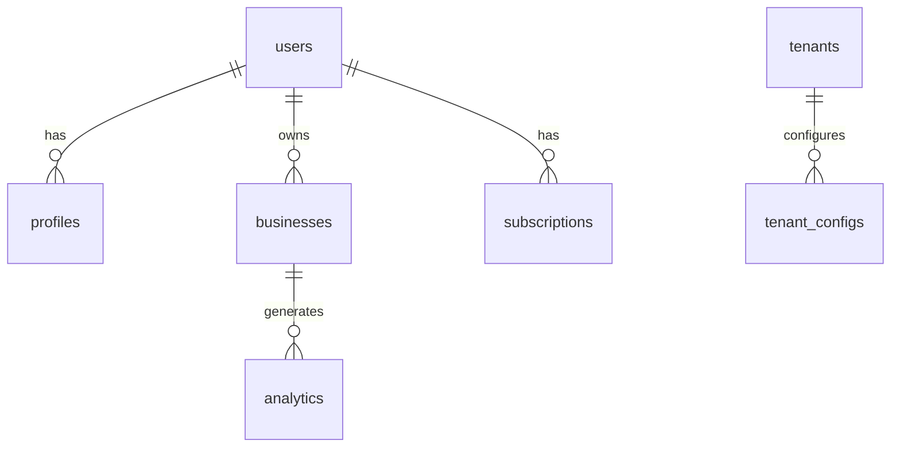
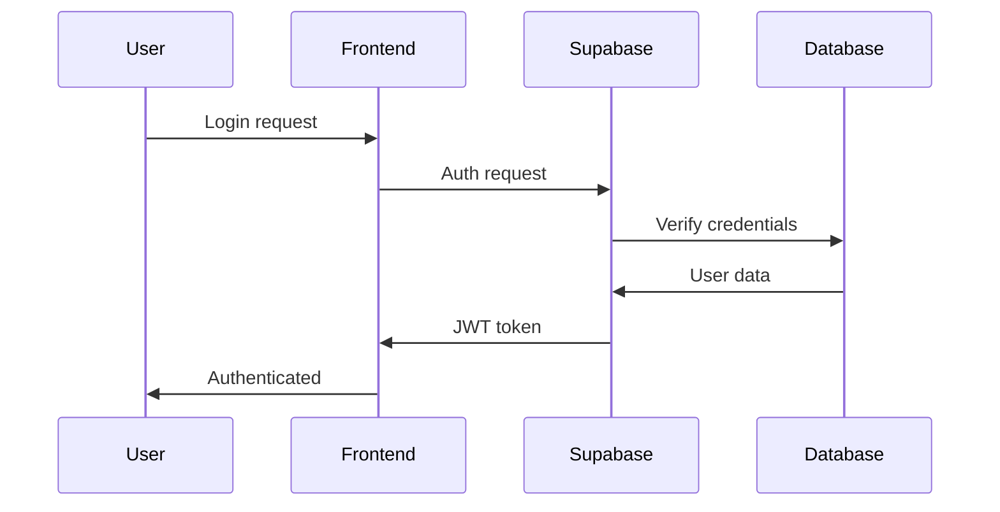

# 🏗️ ARQUITETURA TÉCNICA COMPLETA - VIAJAR & DESCUBRA MS

## 📋 **ÍNDICE**
1. [Visão Geral da Arquitetura](#visão-geral-da-arquitetura)
2. [Stack Tecnológico](#stack-tecnológico)
3. [Arquitetura Multi-Tenant](#arquitetura-multi-tenant)
4. [Banco de Dados](#banco-de-dados)
5. [APIs e Integrações](#apis-e-integrações)
6. [Sistema de Autenticação](#sistema-de-autenticação)
7. [IA e Machine Learning](#ia-e-machine-learning)
8. [Deploy e Infraestrutura](#deploy-e-infraestrutura)
9. [Segurança](#segurança)
10. [Monitoramento](#monitoramento)

---

## 🎯 **VISÃO GERAL DA ARQUITETURA**

### **Arquitetura Multi-Stack**
```
┌─────────────────────────────────────────────────────────────┐
│                    FRONTEND (React)                         │
├─────────────────────────────────────────────────────────────┤
│                    BACKEND (Supabase)                       │
├─────────────────────────────────────────────────────────────┤
│                    AI SERVICES (Gemini)                    │
├─────────────────────────────────────────────────────────────┤
│                    EXTERNAL APIs                           │
└─────────────────────────────────────────────────────────────┘
```

### **Princípios Arquiteturais**
- **Modularidade**: Componentes reutilizáveis
- **Escalabilidade**: Multi-tenant nativo
- **Performance**: Otimização contínua
- **Segurança**: Defense in depth
- **Manutenibilidade**: Código limpo e documentado

---

## 🛠️ **STACK TECNOLÓGICO**

### **Frontend**
```typescript
// Core
React 18.2.0 + TypeScript 5.0+
Vite 5.0+ (Build tool)
Tailwind CSS 3.4+ (Styling)

// UI Components
shadcn/ui (Component library)
Radix UI (Primitives)
Lucide React (Icons)

// State Management
React Query (Server state)
React Context (Local state)
Zustand (Global state)

// Routing
React Router v6 (Navigation)
Lazy Loading (Performance)
```

### **Backend**
```typescript
// Database
Supabase PostgreSQL 15+
Row Level Security (RLS)
Real-time subscriptions

// Authentication
Supabase Auth
JWT tokens
OAuth providers

// Edge Functions
Deno runtime
TypeScript
Serverless functions
```

### **AI & ML**
```typescript
// AI Services
Google Gemini API
Custom AI services
RAG (Retrieval Augmented Generation)

// Search
Google Custom Search
Web scraping
Data processing
```

---

## 🏢 **ARQUITETURA MULTI-TENANT**

### **Estrutura de Tenants**
```typescript
interface TenantConfig {
  id: string;
  name: string;
  region: string;
  config: {
    branding: BrandConfig;
    features: FeatureConfig;
    integrations: IntegrationConfig;
  };
}

// Exemplos
const tenants = {
  'ms': {
    id: 'ms',
    name: 'Descubra MS',
    region: 'Mato Grosso do Sul',
    config: msConfig
  },
  'viajar': {
    id: 'viajar',
    name: 'ViaJAR',
    region: 'Global',
    config: viajarConfig
  }
};
```

### **Detecção de Tenant**
```typescript
// URL-based detection
/viajar/* → ViaJAR tenant
/ms/* → Descubra MS tenant
/* → Default tenant

// Subdomain-based (future)
viajar.app.com → ViaJAR
ms.app.com → Descubra MS
```

### **Isolamento de Dados**
```sql
-- Row Level Security
CREATE POLICY tenant_isolation ON users
  FOR ALL TO authenticated
  USING (tenant_id = current_setting('app.tenant_id'));

-- Tenant-specific tables
CREATE TABLE ms_events (...);
CREATE TABLE viajar_subscriptions (...);
```

---

## 🗄️ **BANCO DE DADOS**

### **Schema Principal**
```sql
-- Users & Authentication
users (id, email, tenant_id, role, created_at)
profiles (user_id, full_name, avatar, business_data)
sessions (id, user_id, expires_at)

-- Business Logic
businesses (id, user_id, name, category, cadastur, cnpj)
subscriptions (id, user_id, plan_id, status, billing_period)
analytics (id, business_id, metric, value, date)

-- Multi-tenant
tenants (id, name, config, region)
tenant_configs (tenant_id, key, value)
```

### **Relacionamentos**


### **Índices de Performance**
```sql
-- Performance indexes
CREATE INDEX idx_users_tenant ON users(tenant_id);
CREATE INDEX idx_businesses_user ON businesses(user_id);
CREATE INDEX idx_analytics_business ON analytics(business_id, date);
CREATE INDEX idx_subscriptions_user ON subscriptions(user_id, status);
```

---

## 🔌 **APIS E INTEGRAÇÕES**

### **APIs Internas (Supabase)**
```typescript
// Database API
const { data, error } = await supabase
  .from('businesses')
  .select('*')
  .eq('user_id', userId);

// Real-time subscriptions
const subscription = supabase
  .channel('analytics')
  .on('postgres_changes', {
    event: 'INSERT',
    schema: 'public',
    table: 'analytics'
  }, (payload) => {
    updateDashboard(payload.new);
  })
  .subscribe();
```

### **APIs Externas**
```typescript
// Google APIs
Google Search API → Event discovery
Google Maps API → Geolocation
Google Gemini API → AI processing

// Government APIs
ALUMIA API → MS tourism data
CADASTUR API → Business verification
State APIs → Regional data

// Payment APIs
Stripe API → Payment processing
PagSeguro API → Brazilian payments
```

### **Edge Functions**
```typescript
// AI Processing
export default async function processEvent(req: Request) {
  const { event } = await req.json();
  
  // Google Search
  const searchResults = await googleSearch(event.query);
  
  // Gemini AI processing
  const processedEvent = await geminiProcess(searchResults);
  
  return new Response(JSON.stringify(processedEvent));
}
```

---

## 🔐 **SISTEMA DE AUTENTICAÇÃO**

### **Fluxo de Autenticação**


### **Roles e Permissões**
```typescript
enum UserRole {
  ADMIN = 'admin',
  GESTOR_MUNICIPAL = 'gestor_municipal',
  CAT_ATTENDANT = 'cat_attendant',
  USER = 'user',
  BUSINESS = 'business'
}

// Permission matrix
const permissions = {
  admin: ['*'],
  gestor_municipal: ['read_analytics', 'manage_cats'],
  cat_attendant: ['read_cats', 'update_attendance'],
  user: ['read_own_data'],
  business: ['manage_business', 'view_analytics']
};
```

### **Multi-Factor Authentication**
```typescript
// CADASTUR verification
const verifyCadastur = async (cadastur: string, cnpj: string) => {
  const response = await fetch('/api/verify-cadastur', {
    method: 'POST',
    body: JSON.stringify({ cadastur, cnpj })
  });
  return response.json();
};

// Business category validation
const validateBusinessCategory = (category: string) => {
  return BUSINESS_CATEGORIES.includes(category);
};
```

---

## 🤖 **IA E MACHINE LEARNING**

### **Arquitetura de IA**
```typescript
// AI Services Architecture
interface AIService {
  process(input: any): Promise<any>;
  fallback(input: any): Promise<any>;
}

// Gemini Integration
class GeminiService implements AIService {
  async process(event: Event): Promise<ProcessedEvent> {
    const prompt = this.buildPrompt(event);
    const response = await this.gemini.generateContent(prompt);
    return this.parseResponse(response);
  }
  
  async fallback(event: Event): Promise<ProcessedEvent> {
    return this.mockProcessing(event);
  }
}
```

### **RAG (Retrieval Augmented Generation)**
```typescript
// Knowledge base integration
const ragService = {
  retrieve: async (query: string) => {
    // Search knowledge base
    const results = await searchKnowledgeBase(query);
    return results;
  },
  
  generate: async (context: string[], query: string) => {
    // Generate response with context
    const prompt = this.buildRAGPrompt(context, query);
    return await gemini.generateContent(prompt);
  }
};
```

### **Event Intelligence**
```typescript
// Smart event processing
class EventIntelligenceService {
  async discoverEvents(region: string): Promise<Event[]> {
    // Google Search for events
    const searchResults = await googleSearch(`eventos ${region}`);
    
    // Process with AI
    const processedEvents = await Promise.all(
      searchResults.map(event => this.processEvent(event))
    );
    
    return processedEvents;
  }
  
  async processEvent(event: Event): Promise<ProcessedEvent> {
    // AI enhancement
    const enhanced = await gemini.enhanceDescription(event);
    return { ...event, ...enhanced };
  }
}
```

---

## 🚀 **DEPLOY E INFRAESTRUTURA**

### **Frontend Deploy (Vercel)**
```yaml
# vercel.json
{
  "framework": "vite",
  "buildCommand": "npm run build",
  "outputDirectory": "dist",
  "env": {
    "VITE_SUPABASE_URL": "@supabase-url",
    "VITE_SUPABASE_ANON_KEY": "@supabase-anon-key"
  }
}
```

### **Backend Deploy (Supabase)**
```sql
-- Database migrations
CREATE TABLE IF NOT EXISTS businesses (
  id UUID PRIMARY KEY DEFAULT gen_random_uuid(),
  user_id UUID REFERENCES users(id),
  name TEXT NOT NULL,
  category TEXT NOT NULL,
  cadastur TEXT,
  cnpj TEXT,
  created_at TIMESTAMP DEFAULT NOW()
);

-- Row Level Security
ALTER TABLE businesses ENABLE ROW LEVEL SECURITY;
CREATE POLICY business_owner ON businesses
  FOR ALL TO authenticated
  USING (user_id = auth.uid());
```

### **Edge Functions Deploy**
```typescript
// supabase/functions/process-events/index.ts
import { serve } from "https://deno.land/std@0.168.0/http/server.ts"

serve(async (req) => {
  const { event } = await req.json()
  
  // Process event with AI
  const processed = await processEventWithAI(event)
  
  return new Response(JSON.stringify(processed))
})
```

---

## 🛡️ **SEGURANÇA**

### **Defense in Depth**
```typescript
// Multiple security layers
1. Network Security (HTTPS, CORS)
2. Authentication (JWT, OAuth)
3. Authorization (RBAC, RLS)
4. Input Validation (Zod schemas)
5. Rate Limiting (API limits)
6. Data Encryption (At rest & in transit)
```

### **Input Validation**
```typescript
import { z } from 'zod';

const businessSchema = z.object({
  name: z.string().min(1).max(100),
  category: z.enum(['hotel', 'restaurant', 'agency']),
  cadastur: z.string().regex(/^\d{6}$/),
  cnpj: z.string().regex(/^\d{14}$/)
});

// Validate all inputs
const validateBusiness = (data: unknown) => {
  return businessSchema.parse(data);
};
```

### **Rate Limiting**
```typescript
// API rate limiting
const rateLimiter = {
  '/api/events': { requests: 100, window: '1h' },
  '/api/ai': { requests: 50, window: '1h' },
  '/api/analytics': { requests: 200, window: '1h' }
};
```

---

## 📊 **MONITORAMENTO**

### **Métricas de Performance**
```typescript
// Performance monitoring
const metrics = {
  pageLoad: '< 2s',
  apiResponse: '< 500ms',
  databaseQuery: '< 100ms',
  aiProcessing: '< 5s'
};

// Real-time monitoring
const monitor = {
  uptime: '99.9%',
  errorRate: '< 0.1%',
  responseTime: 'p95 < 1s'
};
```

### **Logging e Alertas**
```typescript
// Structured logging
const logger = {
  info: (message: string, meta?: any) => {
    console.log(JSON.stringify({ level: 'info', message, meta }));
  },
  error: (message: string, error?: Error) => {
    console.error(JSON.stringify({ level: 'error', message, error }));
  }
};

// Alert system
const alerts = {
  highErrorRate: 'Error rate > 5%',
  slowResponse: 'Response time > 2s',
  lowUptime: 'Uptime < 99%'
};
```

---

## 🔄 **CI/CD PIPELINE**

### **GitHub Actions**
```yaml
# .github/workflows/deploy.yml
name: Deploy
on:
  push:
    branches: [main]

jobs:
  deploy:
    runs-on: ubuntu-latest
    steps:
      - uses: actions/checkout@v3
      - uses: actions/setup-node@v3
        with:
          node-version: '18'
      - run: npm install
      - run: npm run build
      - run: npm run test
      - uses: vercel/action@v1
        with:
          vercel-token: ${{ secrets.VERCEL_TOKEN }}
```

### **Database Migrations**
```bash
# Migration workflow
npx supabase db diff --schema public
npx supabase db push
npx supabase db reset --linked
```

---

## 📈 **ESCALABILIDADE**

### **Horizontal Scaling**
- **Frontend**: CDN + Edge caching
- **Backend**: Supabase auto-scaling
- **Database**: Read replicas + Connection pooling
- **AI**: Multiple API keys + Rate limiting

### **Performance Optimization**
```typescript
// Code splitting
const LazyComponent = lazy(() => import('./Component'));

// Memoization
const MemoizedComponent = memo(ExpensiveComponent);

// Virtual scrolling
const VirtualList = ({ items }) => {
  return items.map(item => <Item key={item.id} {...item} />);
};
```

---

*Documento gerado em: Janeiro 2024*  
*Versão: 1.0*  
*Status: Atualizado*

