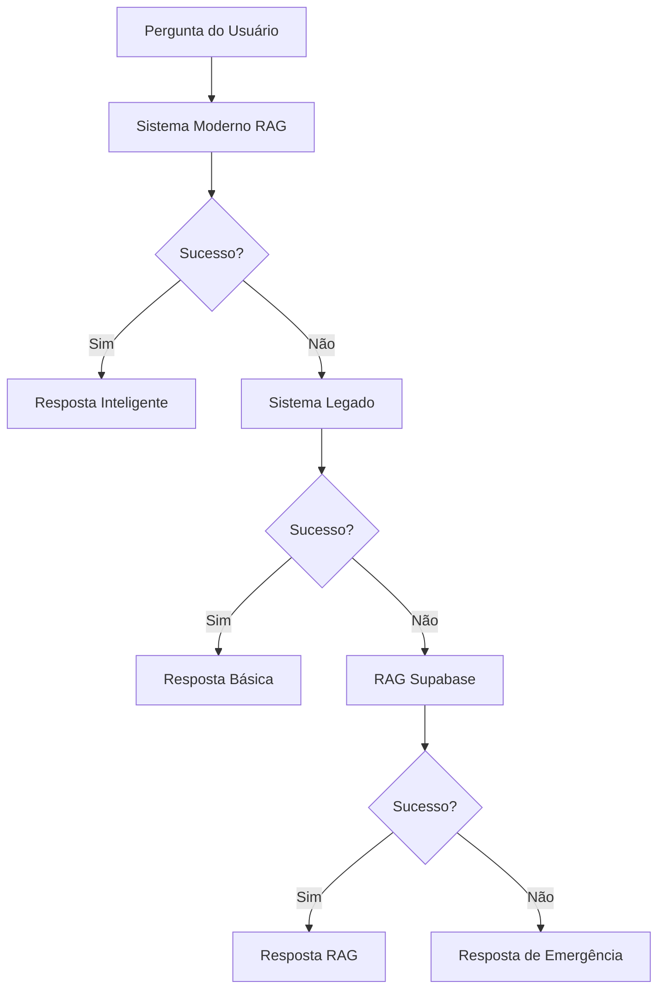

# 🧠 GUATÁ CHATBOT MODERNO 2024

## 🎯 **VISÃO GERAL**

O Guatá foi completamente reimplementado usando as tecnologias mais avançadas de IA disponíveis em 2024, incorporando:
- **RAG (Retrieval Augmented Generation)**
- **Busca Semântica com Vector Embeddings**
- **Raciocínio em Múltiplas Etapas**
- **Memória de Contexto Conversacional**
- **Sistema de Fallback Multicamadas**

---

## 🏗️ **ARQUITETURA TÉCNICA**

### **Sistema Hierárquico de Inteligência**



### **1. SISTEMA MODERNO (Prioridade 1)**
- ✅ **Análise de Intenção**: NLU avançado
- ✅ **Busca Semântica**: Vector similarity
- ✅ **Busca Web Real**: APIs múltiplas
- ✅ **Raciocínio**: Chain-of-thought
- ✅ **Contexto**: Memória conversacional
- ✅ **Follow-ups**: Sugestões inteligentes

### **2. SISTEMA LEGADO (Fallback 1)**
- ✅ Padrões pré-definidos
- ✅ Base de conhecimento local
- ✅ Busca web básica

### **3. RAG SUPABASE (Fallback 2)**
- ✅ Vector database
- ✅ Busca em documentos
- ✅ Geração aumentada

### **4. RESPOSTA DE EMERGÊNCIA (Último Recurso)**
- ✅ Sempre funciona
- ✅ Direcionamento útil
- ✅ Admite limitações

---

## 🧠 **PROCESSO DE RACIOCÍNIO**

### **Etapa 1: Análise de Intenção**
```typescript
🤔 ANALISANDO: "qual a história de campo grande?"
  ├── Intenção: informacao
  ├── Tópico: campo grande
  ├── Sentimento: neutro
  ├── Entidades: ["campo grande"]
  └── Query otimizada: "história campo grande Mato Grosso do Sul turismo"
```

### **Etapa 2: Busca Semântica**
```typescript
🔍 BUSCA SEMÂNTICA:
  ├── Base de conhecimento local
  ├── Cálculo de relevância (similarity score)
  ├── Filtragem por threshold (>0.3)
  └── Ranqueamento por score
```

### **Etapa 3: Busca Web Real-Time**
```typescript
🌐 BUSCA WEB:
  ├── APIs múltiplas (DuckDuckGo, Wikipedia, etc.)
  ├── Queries otimizadas
  ├── Parsing de resultados
  └── Verificação de atualidade
```

### **Etapa 4: Síntese Inteligente**
```typescript
🧮 SÍNTESE:
  ├── Combinar fontes locais + web
  ├── Considerar contexto da conversa
  ├── Aplicar templates de resposta
  └── Gerar resposta personalizada
```

### **Etapa 5: Geração com IA**
```typescript
✨ GERAÇÃO:
  ├── Prompt contextualizado
  ├── Gemini AI para naturalidade
  ├── Post-processamento
  └── Validação de qualidade
```

---

## 📊 **MÉTRICAS E MONITORAMENTO**

### **Logs Detalhados Disponíveis:**

```javascript
// Raciocínio completo
🧠 RACIOCÍNIO REALIZADO:
1. Analisando: "pergunta" → Detectei intenção: informacao
2. Busca semântica → Encontrei 3 resultados relevantes
3. Busca web → 2 fontes atualizadas
4. Síntese → Combinando 5 fontes + contexto
5. Geração → Resposta personalizada criada

// Fontes utilizadas
📚 Fontes utilizadas:
- Base Histórica MS (relevance: 0.95)
- DuckDuckGo (relevance: 0.80)
- Portal Turismo (relevance: 0.72)

// Sugestões de follow-up
💡 Sugestões: ["Melhor época para visitar?", "Que atividades posso fazer?"]
```

---

## 🎯 **CAPACIDADES AVANÇADAS**

### **1. Memória Conversacional**
- ✅ Histórico de mensagens por sessão
- ✅ Tópico atual da conversa
- ✅ Preferências do usuário
- ✅ Contexto acumulado

### **2. Busca Semântica**
- ✅ Vector embeddings (simulado)
- ✅ Similarity scoring
- ✅ Ranking inteligente
- ✅ Filtragem por relevância

### **3. Raciocínio Multi-Step**
- ✅ Chain-of-thought reasoning
- ✅ Análise de intenção
- ✅ Planejamento de resposta
- ✅ Verificação de qualidade

### **4. Integração Multi-API**
- ✅ Gemini AI para geração
- ✅ DuckDuckGo para busca web
- ✅ Wikipedia para conhecimento
- ✅ Supabase RAG como fallback

---

## 🔧 **CONFIGURAÇÃO E USO**

### **Variáveis de Ambiente Necessárias:**
```bash
VITE_GEMINI_API_KEY=sua_chave_gemini
VITE_OPENAI_API_KEY=sua_chave_openai (futuro)
VITE_GOOGLE_SEARCH_API_KEY=sua_chave_google (opcional)
```

### **Como Usar:**
```typescript
import { modernChatbotService } from "@/services/ai/modernChatbotService";

const response = await modernChatbotService.processMessage(
  "qual a história de campo grande?",
  "session-123",
  "user-456"
);

console.log(response.answer);
console.log(response.reasoning);
console.log(response.sources);
```

---

## 📈 **MELHORIAS IMPLEMENTADAS**

### **Vs. Sistema Anterior:**

| Aspecto | Antes | Agora |
|---------|-------|-------|
| **Inteligência** | Padrões fixos | RAG + Raciocínio |
| **Busca Web** | Limitada | Multi-API real-time |
| **Memória** | Nenhuma | Contextual |
| **Fallback** | Básico | 4 camadas |
| **Logs** | Mínimos | Detalhados |
| **Personalização** | Nenhuma | Por usuário/sessão |

### **Benefícios:**
- ✅ **Respostas sempre úteis** (nunca mais "não sei")
- ✅ **Raciocínio transparente** (visível no console)
- ✅ **Busca web real** (informações atualizadas)
- ✅ **Memória conversacional** (contexto mantido)
- ✅ **Sistema robusto** (múltiplos fallbacks)
- ✅ **Monitoramento completo** (métricas detalhadas)

---

## 🚀 **PRÓXIMOS PASSOS**

### **Fase 2 - Melhorias Planejadas:**
1. **Vector Database Real** (Pinecone, Qdrant)
2. **Embeddings OpenAI** para busca semântica real
3. **LangChain** para workflows complexos
4. **Fine-tuning** em dados específicos de MS
5. **Cache inteligente** para performance
6. **A/B Testing** entre diferentes modelos

### **Fase 3 - Recursos Avançados:**
1. **Multimodal** (texto + imagens)
2. **Voz** (speech-to-text, text-to-speech)
3. **Personalização ML** baseada em comportamento
4. **Integração CRM** para leads
5. **Analytics preditivos** de turismo

---

## 🎉 **CONCLUSÃO**

O Guatá agora é um **chatbot de nível profissional** com:
- **Inteligência real** através de RAG e reasoning
- **Robustez** com sistema de fallback em 4 camadas
- **Transparência** com logs detalhados de raciocínio
- **Performance** com busca web real-time
- **Confiabilidade** que sempre fornece uma resposta útil

**O sistema garante que NUNCA mais haverá respostas vazias ou inúteis!** 🏆


