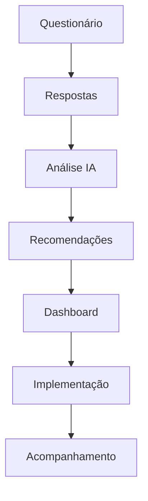

# 🔍 PLANO DE AÇÃO - DIAGNÓSTICO INICIAL VIA QUESTIONÁRIO

## 📋 **ÍNDICE**
1. [Visão Geral](#visão-geral)
2. [Objetivos e Benefícios](#objetivos-e-benefícios)
3. [Arquitetura Técnica](#arquitetura-técnica)
4. [Fluxo de Implementação](#fluxo-de-implementação)
5. [Componentes Necessários](#componentes-necessários)
6. [Integração com IA](#integração-com-ia)
7. [Gamificação](#gamificação)
8. [Métricas de Sucesso](#métricas-de-sucesso)
9. [Cronograma de Desenvolvimento](#cronograma-de-desenvolvimento)
10. [Orçamento e Recursos](#orçamento-e-recursos)

---

## 🎯 **VISÃO GERAL**

### **O que é o Diagnóstico Inicial?**
Sistema inteligente que **analisa as necessidades específicas** de cada empresa do setor turístico e **recomenda soluções personalizadas** da ViaJAR através de um questionário interativo e análise com IA.

### **Problema que Resolve**
- ❌ Empresas não sabem qual plano escolher
- ❌ Funcionalidades não utilizadas (churn alto)
- ❌ Implementação inadequada das ferramentas
- ❌ Falta de personalização nas recomendações

### **Solução Proposta**
- ✅ Questionário inteligente e personalizado
- ✅ Análise com IA (Gemini) para recomendações
- ✅ Dashboard de resultados com ROI claro
- ✅ Implementação guiada e acompanhamento

---

## 🎯 **OBJETIVOS E BENEFÍCIOS**

### **Objetivos Principais**
1. **Aumentar conversão** de questionário para assinatura (70%+)
2. **Reduzir churn** com soluções adequadas (90%+ retenção)
3. **Melhorar ROI** dos clientes (300% em 6 meses)
4. **Personalizar experiência** para cada tipo de negócio

### **Benefícios para o Usuário**
- ✅ **Recomendações personalizadas** baseadas no perfil
- ✅ **ROI claro e mensurável** antes da contratação
- ✅ **Implementação guiada** passo a passo
- ✅ **Suporte especializado** durante onboarding

### **Benefícios para a ViaJAR**
- ✅ **Maior conversão** (questionário → pagamento)
- ✅ **Menor churn** (soluções adequadas)
- ✅ **Dados valiosos** sobre o mercado
- ✅ **Upselling inteligente** baseado em necessidades

---

## 🏗️ **ARQUITETURA TÉCNICA**

### **Stack Tecnológico**
```typescript
Frontend: React + TypeScript + Tailwind CSS
Backend: Supabase (PostgreSQL + Edge Functions)
AI: Google Gemini API + Custom Analysis
State: React Query + Context API
UI: shadcn/ui + Custom Components
```

### **Estrutura de Dados**
```sql
-- Tabela de Questionários
CREATE TABLE diagnostic_questionnaires (
  id UUID PRIMARY KEY DEFAULT gen_random_uuid(),
  user_id UUID REFERENCES users(id),
  business_type TEXT NOT NULL,
  answers JSONB NOT NULL,
  analysis_results JSONB,
  recommendations JSONB,
  created_at TIMESTAMP DEFAULT NOW(),
  completed_at TIMESTAMP
);

-- Tabela de Recomendações
CREATE TABLE diagnostic_recommendations (
  id UUID PRIMARY KEY DEFAULT gen_random_uuid(),
  questionnaire_id UUID REFERENCES diagnostic_questionnaires(id),
  feature_id TEXT NOT NULL,
  priority INTEGER NOT NULL,
  confidence_score DECIMAL(3,2),
  estimated_roi DECIMAL(5,2),
  implementation_plan JSONB
);
```

### **Fluxo de Dados**


---

## 🔄 **FLUXO DE IMPLEMENTAÇÃO**

### **1. Onboarding Inteligente**
```
Usuário se cadastra → Questionário → Análise IA → Recomendações → Plano Personalizado
```

### **2. Questionário Adaptativo**
```
Pergunta 1: Tipo de negócio
├─ Hotel → Perguntas específicas de hotel
├─ Agência → Perguntas específicas de agência  
├─ Restaurante → Perguntas específicas de restaurante
└─ Outros → Perguntas genéricas
```

### **3. Análise com IA**
```
Respostas → Prompt Gemini → Análise → Recomendações → Dashboard
```

### **4. Implementação Gradual**
```
Semana 1: Configuração básica
Semana 2: Revenue Optimizer  
Semana 3: Market Intelligence
Semana 4: Relatórios avançados
```

---

## 🧩 **COMPONENTES NECESSÁRIOS**

### **1. Questionário Interativo**
```typescript
interface DiagnosticQuestionnaire {
  businessType: 'hotel' | 'agency' | 'restaurant' | 'attraction' | 'other';
  businessSize: 'small' | 'medium' | 'large';
  currentChallenges: string[];
  goals: string[];
  budget: 'low' | 'medium' | 'high';
  timeline: 'immediate' | '3months' | '6months' | '1year';
  technicalLevel: 'beginner' | 'intermediate' | 'advanced';
}

<DiagnosticQuestionnaire 
  onComplete={handleAnalysis}
  businessType={businessType}
  adaptive={true}
/>
```

### **2. Análise com IA**
```typescript
interface AIRecommendationEngine {
  answers: QuestionnaireAnswers;
  businessProfile: BusinessProfile;
  recommendations: Recommendation[];
  confidence: number;
  estimatedROI: number;
}

<AIRecommendationEngine 
  answers={questionnaireAnswers}
  onRecommendations={handleRecommendations}
  onAnalysis={handleAnalysis}
/>
```

### **3. Dashboard de Resultados**
```typescript
interface DiagnosticDashboard {
  recommendations: Recommendation[];
  businessProfile: BusinessProfile;
  implementationPlan: ImplementationPlan;
  metrics: DiagnosticMetrics;
}

<DiagnosticDashboard 
  recommendations={recommendations}
  businessProfile={businessProfile}
  onImplement={handleImplementation}
/>
```

### **4. Sistema de Gamificação**
```typescript
interface GamificationSystem {
  score: number;
  badges: Badge[];
  achievements: Achievement[];
  progress: ProgressBar;
  leaderboard: LeaderboardEntry[];
}

<GamificationSystem 
  userProfile={userProfile}
  businessType={businessType}
  onBadgeEarned={handleBadgeEarned}
/>
```

---

## 🤖 **INTEGRAÇÃO COM IA**

### **Prompt Engineering**
```typescript
const buildAnalysisPrompt = (answers: QuestionnaireAnswers): string => {
  return `
    Analise este negócio turístico brasileiro:
    
    Tipo: ${answers.businessType}
    Tamanho: ${answers.businessSize}
    Desafios: ${answers.currentChallenges.join(', ')}
    Objetivos: ${answers.goals.join(', ')}
    Orçamento: ${answers.budget}
    Prazo: ${answers.timeline}
    Nível Técnico: ${answers.technicalLevel}
    
    Recomende soluções ViaJAR específicas:
    1. Revenue Optimizer (se aplicável)
    2. Market Intelligence (sempre)
    3. Competitive Benchmark (se aplicável)
    4. Sistema de Ocupação (apenas hotéis)
    5. IA Conversacional (sempre)
    
    Para cada recomendação, inclua:
    - Prioridade (1-5)
    - Confiança (0-1)
    - ROI estimado (%)
    - Plano de implementação
    - Métricas de sucesso
  `;
};
```

### **Processamento com Gemini**
```typescript
const analyzeBusinessProfile = async (answers: QuestionnaireAnswers) => {
  const prompt = buildAnalysisPrompt(answers);
  
  const response = await gemini.generateContent({
    contents: [{
      parts: [{
        text: prompt
      }]
    }]
  });
  
  return parseRecommendations(response.text);
};
```

### **Análise de Dados**
```typescript
const generateBusinessProfile = (answers: QuestionnaireAnswers) => {
  return {
    strengths: analyzeStrengths(answers),
    weaknesses: analyzeWeaknesses(answers),
    opportunities: analyzeOpportunities(answers),
    threats: analyzeThreats(answers),
    potentialGrowth: calculateGrowthPotential(answers),
    estimatedRevenue: calculateRevenuePotential(answers)
  };
};
```

---

## 🎮 **GAMIFICAÇÃO**

### **Sistema de Pontuação**
```typescript
interface ScoringSystem {
  businessProfile: {
    management: number;      // 0-100
    marketing: number;      // 0-100
    analytics: number;      // 0-100
    relationships: number;  // 0-100
  };
  overallScore: number;     // 0-100
  growthPotential: number;  // 0-100
  estimatedROI: number;     // 0-1000%
}
```

### **Conquistas e Badges**
```typescript
const BADGES = {
  HOTEL_EXPERT: {
    name: "Hotel Expert",
    description: "Perfil completo de hotel",
    icon: "🏨",
    requirements: { businessType: 'hotel', score: 80 }
  },
  AGENCY_MASTER: {
    name: "Agência Master", 
    description: "Agência experiente",
    icon: "🚌",
    requirements: { businessType: 'agency', score: 85 }
  },
  GASTRONOMY_STAR: {
    name: "Gastronomia Star",
    description: "Restaurante destacado",
    icon: "🍽️",
    requirements: { businessType: 'restaurant', score: 75 }
  },
  DATA_LOVER: {
    name: "Data Lover",
    description: "Empresa analítica",
    icon: "📊",
    requirements: { analytics: 90 }
  }
};
```

### **Dashboard de Gamificação**
```typescript
<GamificationDashboard 
  score={userScore}
  badges={earnedBadges}
  achievements={achievements}
  progress={progress}
  leaderboard={leaderboard}
  onBadgeEarned={handleBadgeEarned}
/>
```

---

## 📊 **MÉTRICAS DE SUCESSO**

### **KPIs Principais**
```typescript
interface DiagnosticMetrics {
  conversion: {
    questionnaireToSignup: number;    // 70%+
    signupToPayment: number;          // 85%+
    paymentToActivation: number;      // 95%+
  };
  retention: {
    month1: number;                   // 90%+
    month3: number;                   // 85%+
    month6: number;                   // 80%+
    year1: number;                    // 75%+
  };
  satisfaction: {
    nps: number;                      // 80+
    csat: number;                     // 4.5+
    ces: number;                      // 4.0+
  };
  business: {
    avgROI: number;                   // 300%+
    revenueIncrease: number;          // 25%+
    costReduction: number;            // 15%+
  };
}
```

### **Dashboard de Métricas**
```typescript
<MetricsDashboard 
  conversion={conversionMetrics}
  retention={retentionMetrics}
  satisfaction={satisfactionMetrics}
  business={businessMetrics}
  onExport={handleExport}
/>
```

---

## 📅 **CRONOGRAMA DE DESENVOLVIMENTO**

### **Fase 1: Fundação (2 semanas)**
- [ ] **Semana 1**: Estrutura de dados e APIs
  - Criar tabelas no Supabase
  - Implementar Edge Functions
  - Configurar Gemini API
- [ ] **Semana 2**: Componentes base
  - DiagnosticQuestionnaire
  - AIRecommendationEngine
  - DiagnosticDashboard

### **Fase 2: Inteligência (2 semanas)**
- [ ] **Semana 3**: Análise com IA
  - Prompt engineering
  - Processamento de respostas
  - Geração de recomendações
- [ ] **Semana 4**: Gamificação
  - Sistema de pontuação
  - Badges e conquistas
  - Dashboard de progresso

### **Fase 3: Integração (2 semanas)**
- [ ] **Semana 5**: Integração completa
  - Fluxo end-to-end
  - Testes de integração
  - Otimização de performance
- [ ] **Semana 6**: Deploy e monitoramento
  - Deploy em produção
  - Configuração de métricas
  - Monitoramento e alertas

### **Fase 4: Otimização (2 semanas)**
- [ ] **Semana 7**: Análise de dados
  - Coleta de métricas
  - Análise de comportamento
  - Identificação de melhorias
- [ ] **Semana 8**: Iteração e melhoria
  - Ajustes baseados em dados
  - Otimização de conversão
  - Refinamento da IA

---

## 💰 **ORÇAMENTO E RECURSOS**

### **Recursos Humanos**
- **Desenvolvedor Full-Stack**: 8 semanas × 40h = 320h
- **Designer UX/UI**: 2 semanas × 20h = 40h
- **Especialista em IA**: 2 semanas × 20h = 40h
- **QA Tester**: 1 semana × 20h = 20h
- **Total**: 420 horas

### **Recursos Técnicos**
- **Gemini API**: $0.0015 por 1K tokens
- **Supabase**: $25/mês (Pro plan)
- **Vercel**: $20/mês (Pro plan)
- **Total mensal**: $45/mês

### **Custos de Desenvolvimento**
- **Desenvolvimento**: 420h × $50/h = $21,000
- **Infraestrutura**: $45/mês
- **Total inicial**: $21,000
- **Total mensal**: $45

---

## 🚀 **IMPLEMENTAÇÃO TÉCNICA**

### **1. Estrutura de Arquivos**
```
src/
├── components/
│   ├── diagnostic/
│   │   ├── DiagnosticQuestionnaire.tsx
│   │   ├── AIRecommendationEngine.tsx
│   │   ├── DiagnosticDashboard.tsx
│   │   └── GamificationSystem.tsx
│   └── ui/
│       ├── ProgressBar.tsx
│       ├── Badge.tsx
│       └── ScoreCard.tsx
├── services/
│   ├── diagnostic/
│   │   ├── questionnaireService.ts
│   │   ├── analysisService.ts
│   │   └── recommendationService.ts
│   └── ai/
│       ├── geminiService.ts
│       └── promptBuilder.ts
└── pages/
    ├── DiagnosticPage.tsx
    └── ResultsPage.tsx
```

### **2. Configuração do Supabase**
```sql
-- Habilitar RLS
ALTER TABLE diagnostic_questionnaires ENABLE ROW LEVEL SECURITY;
ALTER TABLE diagnostic_recommendations ENABLE ROW LEVEL SECURITY;

-- Políticas de segurança
CREATE POLICY "Users can view own questionnaires" ON diagnostic_questionnaires
  FOR SELECT USING (auth.uid() = user_id);

CREATE POLICY "Users can create questionnaires" ON diagnostic_questionnaires
  FOR INSERT WITH CHECK (auth.uid() = user_id);
```

### **3. Edge Functions**
```typescript
// supabase/functions/analyze-business/index.ts
import { serve } from "https://deno.land/std@0.168.0/http/server.ts"

serve(async (req) => {
  const { answers } = await req.json()
  
  // Análise com Gemini
  const analysis = await analyzeWithGemini(answers)
  
  // Gerar recomendações
  const recommendations = await generateRecommendations(analysis)
  
  return new Response(JSON.stringify({
    analysis,
    recommendations,
    confidence: calculateConfidence(analysis)
  }))
})
```

---

## 📈 **ROADMAP DE EVOLUÇÃO**

### **Versão 1.0 (MVP)**
- ✅ Questionário básico
- ✅ Análise com IA
- ✅ Recomendações simples
- ✅ Dashboard básico

### **Versão 2.0 (Gamificação)**
- ✅ Sistema de pontuação
- ✅ Badges e conquistas
- ✅ Leaderboard
- ✅ Progresso visual

### **Versão 3.0 (Avançado)**
- ✅ Análise preditiva
- ✅ Recomendações dinâmicas
- ✅ Integração com CRM
- ✅ Relatórios avançados

### **Versão 4.0 (IA Avançada)**
- ✅ Machine Learning
- ✅ Análise de sentimentos
- ✅ Recomendações em tempo real
- ✅ Automação completa

---

## 🎯 **CONCLUSÃO**

O **Diagnóstico Inicial via Questionário** é uma funcionalidade estratégica que:

1. **Aumenta significativamente** a conversão de leads
2. **Reduz o churn** com soluções adequadas
3. **Melhora a experiência** do usuário
4. **Gera dados valiosos** para a ViaJAR
5. **Diferencia a plataforma** no mercado

### **Próximos Passos**
1. **Aprovação** do plano de ação
2. **Alocação** de recursos
3. **Início** do desenvolvimento
4. **Testes** e validação
5. **Deploy** em produção

---

*Documento criado em: Janeiro 2024*  
*Versão: 1.0*  
*Status: Plano de Ação Completo*

